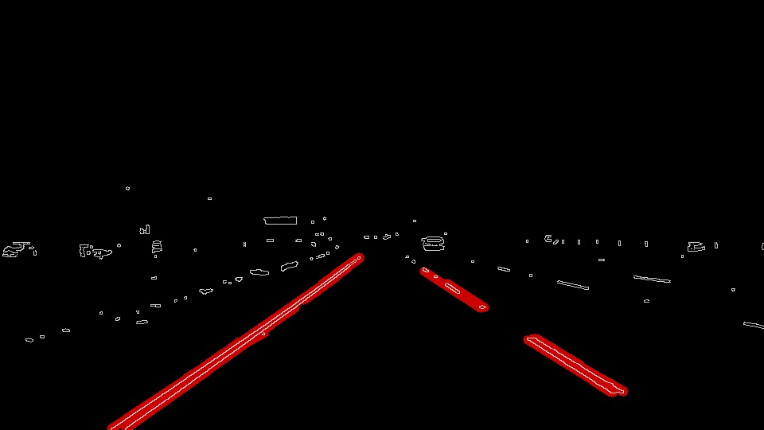

# Project Writeup: Finding Lane Lines
 
## Overview   
   
This writeup reflects upon the "Finding Lane Line" project by explaining how the image processing pipeline works, identifying any shortcomings and proposing potential improvements. 


## Project Goals
The main goals of the **Finding Lane Line** project are:

1. Development of a code pipeline that finds lane lines on the road 
2. Reflection on the above pipeline in the form of a written report

## Reflection

### Pipeline

My image processing pipeline consisted of 8 steps as follows:

1. **Reading in an image:**


2. **Filtering out any non-white and non-yellow pixels:** This is done to make sure that only those pixels are processed later in the pipeline that belong to lane lines only. This helps with filtering out shadows, median, road surface colour change (gray/dark gray potentially due to resurfacing of a patch) that may give the impression of an actual line. This especially applies to the *challenge* video clip. The ```inRange()``` function was mainly used to create a mask along with the ```bitwise_and()``` function.

```python
color_range = [(np.array([175, 175, 0], dtype = "uint8"), np.array([255, 255, 255], dtype = "uint8"))]

mask_white_yellow = cv2.inRange(image,color_range[0][0],color_range[0][1])

white_yellow_image = cv2.bitwise_and(image,image, mask= mask_white_yellow)
```


3. **Converting images to Gray scale:**


4. **Performing edge detection on Gray scale image:**The image was first blurred and then Canny edge detection was applied to obtain object edges, which is a prerequisite for Hough transform.


5. **Applying a mask on the detected edges so that only the area where the left/right lanes appear is kept:**A mask was further applied to restrict image processing only to that area where the left/right lane lines normally appear. Basically a trapezoid ```vertices = np.array([[(60,imshape[0]),(450, 320), (490, 320), (imshape[1],imshape[0])]], dtype=np.int32)``` was used to mark the area of interest.


6. **Applying Hough transformation to identify lines:**To obtain straight lines from Canny edges, Hough transform was applied. The Hough transform identifies potential lines by converting each edge point (image space) into a line (Hough space) and then performing a voting to identify a point where most of the lines intersect, thereby, resulting in the identification of a point in Hough space that represents a straight line in the image space.

