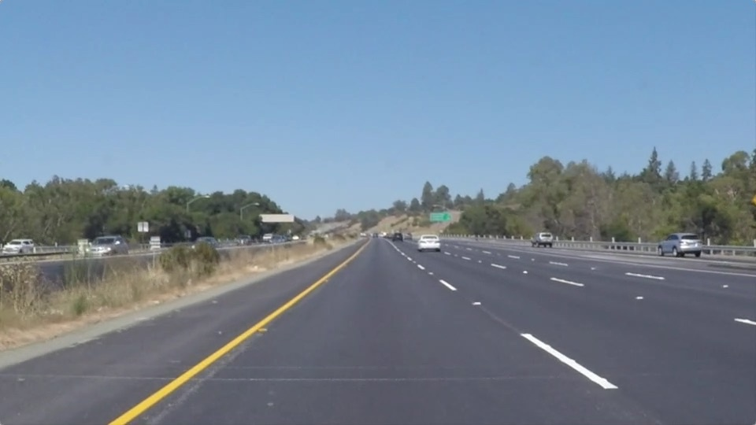
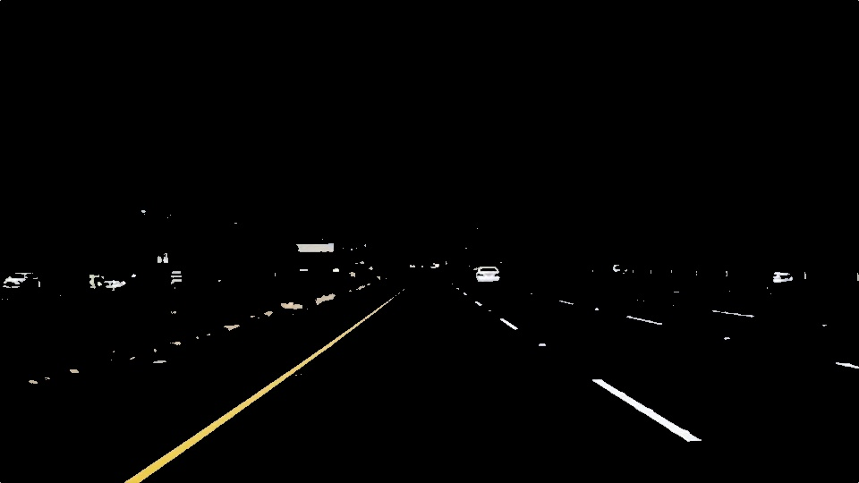
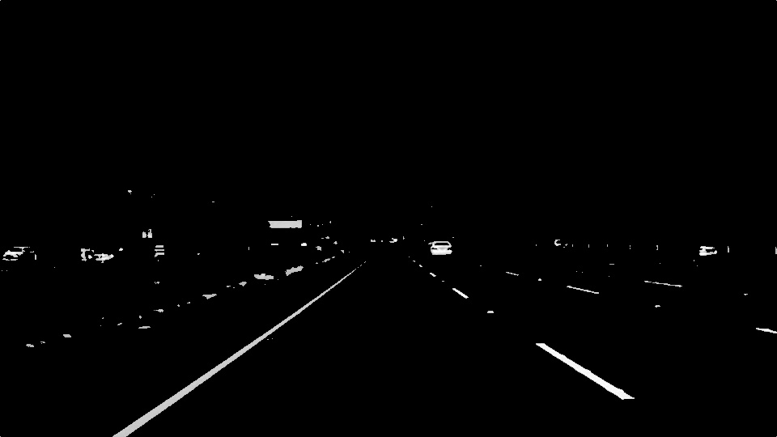
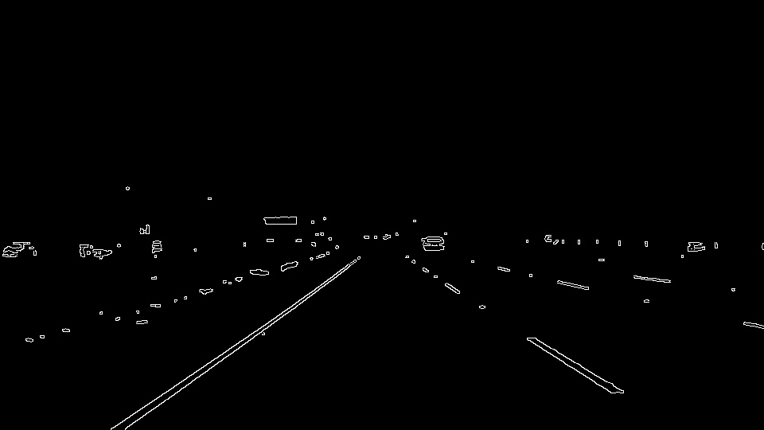
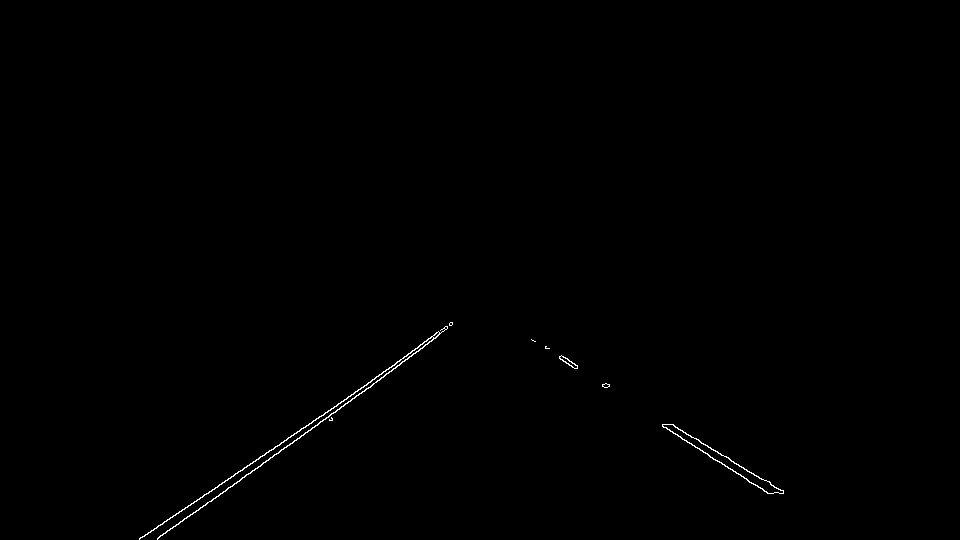
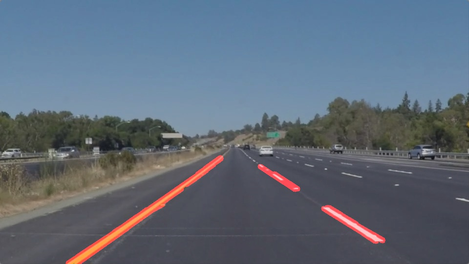
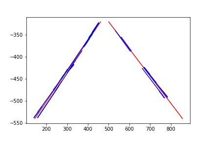
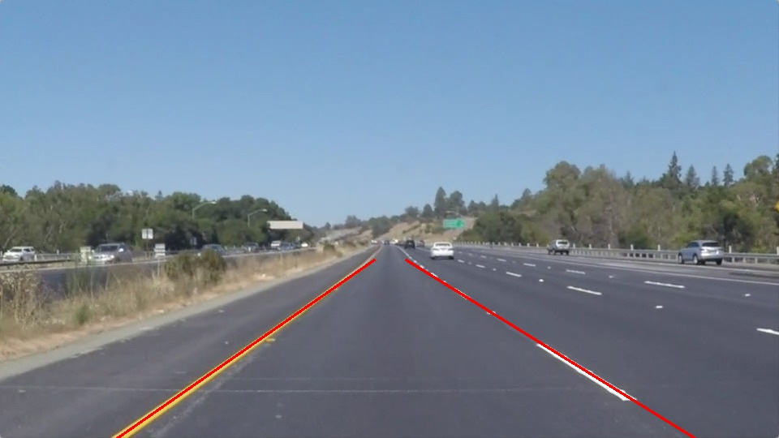

# Project Writeup: Finding Lane Lines
 
## Overview   
   
This writeup reflects upon the "Finding Lane Line" project by explaining how the image processing pipeline works, identifying any shortcomings and proposing potential improvements. 


## Project Goals
The main goals of the **Finding Lane Line** project are:

1. Development of a code pipeline that finds lane lines on the road 
2. Reflection on the above pipeline in the form of a written report

## Reflection

### Pipeline

My image processing pipeline consisted of 8 steps as follows:

1. **Reading in an image:**



2. **Filtering out any non-white and non-yellow pixels:** This is done to make sure that only those pixels are processed later in the pipeline that belong to lane lines only. This helps with filtering out shadows, median, road surface colour change (gray/dark gray potentially due to resurfacing of a patch) that may give the impression of an actual line. This especially applies to the *challenge* video clip. The ```inRange()``` function was mainly used to create a mask along with the ```bitwise_and()``` function.

```python
color_range = [(np.array([175, 175, 0], dtype = "uint8"), np.array([255, 255, 255], dtype = "uint8"))]

mask_white_yellow = cv2.inRange(image,color_range[0][0],color_range[0][1])

white_yellow_image = cv2.bitwise_and(image,image, mask= mask_white_yellow)
```



3. **Converting images to Gray scale:**



4. **Performing edge detection on Gray scale image:** The image was first blurred and then Canny edge detection was applied to obtain object edges, which is a prerequisite for Hough transform.



5. **Applying a mask on the detected edges so that only the area where the left/right lanes appear is kept:** A mask was further applied to restrict image processing only to that area where the left/right lane lines normally appear. Basically a trapezoid ```vertices = np.array([[(60,imshape[0]),(450, 320), (490, 320), (imshape[1],imshape[0])]], dtype=np.int32)``` was used to mark the area of interest.



6. **Applying Hough transformation to identify lines:** To obtain straight lines from Canny edges, Hough transform was applied. The Hough transform identifies potential lines by converting each edge point (image space) into a line (Hough space) and then performing a voting to identify a point where most of the lines intersect, thereby, resulting in the identification of a point in Hough space that represents a straight line in the image space. The image below shows Hough lines combined with the original image.



7. **Finding left/right lane lines:** Having identified lines in the image, it needs to be established which lines belong to left lane lines and which lines belong to right lane lines. For this a new function ```find_left_right_lines()``` was added. The method iterates over all lines and for each line it first finds the slope and then negative slopes are assigned to the left lane while the positive slopes are assigned to the right lane. However, there might be some lines that don't belong to either of the lanes. Such lines normally have a very low slope. So to filter out such lines, any line with a slope between -0.35 and +0.35 is ignored.

```python
for line in lines:
        for x1,y1,x2,y2 in line:
            slope = (y2-y1)/(x2-x1)
            if (slope < 0.35 and slope > -0.35):
                  continue
            elif (slope <= -0.35):
                  left_lines.append(line)
            else:
                right_lines.append(line)
```


8. **Extrapolating left/right lines:** Finally, having found the left/right lane lines, a pair of left/right lane lines can be obtained by extrapolating the left/right lines. A new function ```extrapolate_lines()``` was added. This function first fits a line to each of the left and right line segments. Then it gets the *slope (m)* and the *intercept (b)* values. Then to construct the lane line, the min/max y coordinate values of the mask (the one that was used to restrict the image to only that area where lane lines normally occur) are plugged into the formula *x =  (y-b/m)* to find the corresponding min/max x coordinates. The reason min/max y values are used because the lane lines would always extend from te min y to max y, so all we need to find is the min/max x coordinates of the lane lines as this is what's unknown in the true sense.

```python
left_line_fit = np.polyfit(left_lines_x_points, left_lines_y_points, 1)
    #f_left = np.poly1d(left_line_fit)
    m_left,b_left = left_line_fit
    max_x_left = int((mask_vertices[0][0][1]-b_left)//m_left)
    min_x_left = int(( mask_vertices[0][1][1]-b_left)//m_left)
...
extrapolated_lines = np.array([
        [[min_x_left,  mask_vertices[0][2][1], max_x_left, mask_vertices[0][0][1]]],
        [[min_x_right,  mask_vertices[0][1][1], max_x_right, mask_vertices[0][0][1]]]
    ])
```

Line Segemets with Extrapolated Lines



Final Output


### 2. Identify potential shortcomings with your current pipeline


One potential shortcoming would be what would happen when ... 

Another shortcoming could be ...


### 3. Suggest possible improvements to your pipeline

A possible improvement would be to ...

Another potential improvement could be to ...
